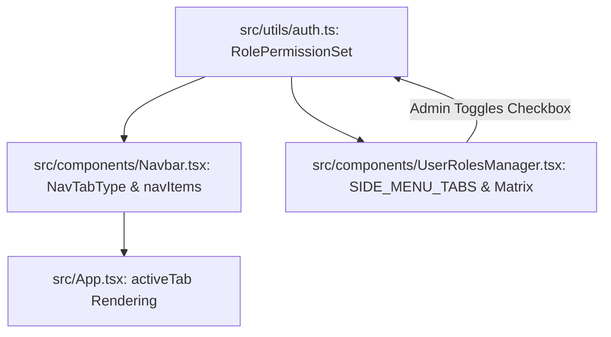

# Adding a New Side Menu Tab & Permissions Matrix Guide

This guide documents the complete process for adding a new Side Menu Navigation Tab to **Cycly Rent** and wiring it into the **"User Level & Tab Access Permissions"** matrix table.

---

## Architecture Overview

Access control and navigation in Cycly Rent are driven by 4 coordinated layers:



1. **Permissions Definition** (`src/utils/auth.ts`): Declares boolean flags in `RolePermissionSet` and default permissions for system roles (`Administrator`, `Store Manager`, `Cashier POS`).
2. **Side Menu Navigation** (`src/components/Navbar.tsx`): Declares tab identifier in `NavTabType` and conditionally renders the icon based on `userPerms.access<Tab>`.
3. **Permissions Matrix & Role Creator** (`src/components/UserRolesManager.tsx`): Declares row entry in `SIDE_MENU_TABS` array which auto-populates the interactive check-box matrix for all user levels.
4. **View Container** (`src/App.tsx`): Conditionally displays the component when `activeTab === '<tabId>'`.

---

## Step-by-Step Implementation Workflow

### Step 1: Define the Permission in `src/utils/auth.ts`

1. **Add the flag to `RolePermissionSet`**:
   ```typescript
   export interface RolePermissionSet {
     accessDashboard?: boolean;
     accessRentals: boolean;
     accessHistory: boolean;
     accessCustomers?: boolean;
     accessMessages?: boolean;   // <-- Add new tab access flag
     accessUsers: boolean;
     accessSettings: boolean;
     accessIncome?: boolean;
     // ...
   }
   ```

2. **Configure default system roles in `DEFAULT_ROLES`**:
   ```typescript
   // In Administrator role:
   accessMessages: true,

   // In Store Manager role:
   accessMessages: true,

   // In Cashier POS role:
   accessMessages: true, // or false depending on default policy
   ```

3. **Update normalization & persistence functions**:
   - In `getStoredRoles()` normalization:
     ```typescript
     accessMessages: role.permissions?.accessMessages ?? (defaultMatch?.permissions?.accessMessages ?? true),
     ```
   - In `updateRolePermissions()` (admin lock):
     ```typescript
     if (roleId === 'admin') {
       updatedPerms.accessMessages = true;
     }
     ```
   - In `getUserPermissions()` (fallback):
     ```typescript
     accessMessages: true,
     ```
   - In `createCustomRole()`:
     ```typescript
     accessMessages: params.permissions?.accessMessages ?? true,
     ```

---

### Step 2: Register the Navigation Tab in `src/components/Navbar.tsx`

1. **Extend `NavTabType` union**:
   ```typescript
   export type NavTabType = 
     | 'rentals' 
     | 'history' 
     | 'users' 
     | 'settings' 
     | 'income' 
     | 'dashboard' 
     | 'customers' 
     | 'messages'; // <-- Add tab ID
   ```

2. **Add item to `navItems` array in `Navbar.tsx`**:
   ```typescript
   {
     id: 'messages' as const,
     label: 'Messages',
     icon: <MessageSquare className="w-4 h-4 shrink-0" />,
     show: userPerms.accessMessages ?? (userPerms.accessCustomers ?? (userPerms.accessRentals || isAdmin)),
     badge: null as number | null,
     activeClass: 'bg-emerald-500/20 text-emerald-400 border border-emerald-500/40',
   },
   ```

---

### Step 3: Add to the Permissions Matrix in `src/components/UserRolesManager.tsx`

1. **Update `roleTabAccess` initial state**:
   ```typescript
   const [roleTabAccess, setRoleTabAccess] = useState({
     accessDashboard: true,
     accessRentals: true,
     accessCustomers: true,
     accessMessages: true, // <-- Add default for new role form
     accessHistory: true,
     accessUsers: false,
     accessSettings: false,
     accessIncome: false,
   });
   ```

2. **Add to `SIDE_MENU_TABS` array**:
   The permissions matrix table auto-generates rows by mapping over `SIDE_MENU_TABS`. Simply add an object:
   ```typescript
   const SIDE_MENU_TABS: {
     key: keyof Pick<RolePermissionSet, 'accessDashboard' | 'accessRentals' | 'accessCustomers' | 'accessMessages' | 'accessHistory' | 'accessUsers' | 'accessSettings' | 'accessIncome'>;
     label: string;
     icon: React.ReactNode;
     badgeColor: string;
     description: string;
   }[] = [
     // ...
     {
       key: 'accessMessages',
       label: 'Messages',
       icon: <MessageSquare className="w-4 h-4 text-emerald-400" />,
       badgeColor: 'text-emerald-400 bg-emerald-500/10 border-emerald-500/30',
       description: 'Customer WhatsApp broadcast campaigns, automated alerts, templates, and message logs',
     },
     // ...
   ];
   ```

3. **Update `handleToggleTabPermission` fallback state**:
   ```typescript
   const current = prev[roleId] || {
     accessDashboard: true,
     accessRentals: true,
     accessCustomers: true,
     accessMessages: true,
     // ...
   };
   ```

4. **Update `handleCreateRoleSubmit`**:
   Include `accessMessages: roleTabAccess.accessMessages` in the `permissions` payload, and reset `accessMessages: true` in `setRoleTabAccess`.

---

### Step 4: Render the Tab Content in `src/App.tsx`

1. **Import the component and icons**:
   ```typescript
   import { CustomerMessagingTab } from './components/CustomerMessagingTab';
   ```

2. **Render when `activeTab === '<tabId>'`**:
   ```tsx
   {activeTab === 'messages' && (
     <div className="space-y-6">
       {/* Card container with theme-contrast styling */}
       <div className={`p-5 sm:p-6 rounded-2xl border ${t.divider} ${t.cardBg} shadow-xl`}>
         <CustomerMessagingTab ... />
       </div>
     </div>
   )}
   ```

---

## File Modification Checklist

| File | Purpose | Key Elements |
|---|---|---|
| [`src/utils/auth.ts`](file:///Users/absiraiva/Documents/Antigravity/Cycly%20Rent/mgr/src/utils/auth.ts) | Access control definition | `RolePermissionSet`, `DEFAULT_ROLES`, `updateRolePermissions`, `getUserPermissions` |
| [`src/components/Navbar.tsx`](file:///Users/absiraiva/Documents/Antigravity/Cycly%20Rent/mgr/src/components/Navbar.tsx) | Side menu rendering | `NavTabType`, `navItems` array, `userPerms.access<Tab>` check |
| [`src/components/UserRolesManager.tsx`](file:///Users/absiraiva/Documents/Antigravity/Cycly%20Rent/mgr/src/components/UserRolesManager.tsx) | Permissions matrix UI | `SIDE_MENU_TABS`, `roleTabAccess`, `handleToggleTabPermission` |
| [`src/App.tsx`](file:///Users/absiraiva/Documents/Antigravity/Cycly%20Rent/mgr/src/App.tsx) | Main page content routing | `activeTab === '<tabId>'` container rendering |

---

## Verification & Testing Commands

To ensure TypeScript type safety and build verification:
```bash
# Check TypeScript types
npx tsc --noEmit

# Test production bundle
npm run build
```
